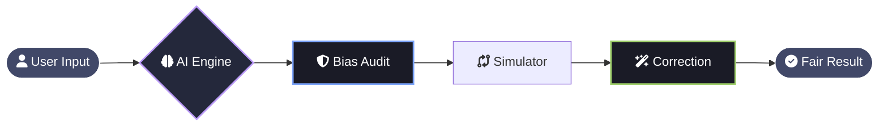
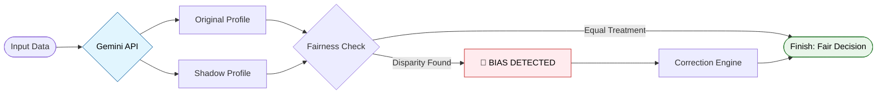

# MedFair AI — Responsible Clinical Decision Auditor

---

MedFair AI is a Digital Bias Detector for medical computers. It acts like a second pair of eyes that double-checks a computer's medical advice to make sure it isn't being unfair based on a patient's gender or age.

If the system finds that a patient is getting different treatment just because of who they are, it flags the mistake, explains it in plain English, and suggests a fair treatment plan. It is a safety net that ensures every person receives the same high-quality care, no matter their background.

---

[](https://www.python.org/)
[](https://developer.mozilla.org/en-US/docs/Web/JavaScript)
[](https://developer.mozilla.org/en-US/docs/Glossary/HTML5)
[](https://developer.mozilla.org/en-US/docs/Web/CSS)
[](https://flask.palletsprojects.com/)
[](https://github.com/tonybaloney/antigravity)
[](https://opensource.org/licenses/MIT)

---

## 📑 Table of Contents

* [🚀 Problem Statement](#-problem-statement)
* [💡 Solution Overview](#-solution-overview)
* [✨ Key Features](#-key-features)
* [🛠️ Tech Stack](#️-tech-stack)
* [🏗️ Architecture](#️-architecture)
* [⚙️ How It Works](#️-how-it-works)
* [🧬 The Logic Flow](#-the-logic-flow)
* [🧪 Example Scenario](#-example-scenario)
* [📂 Repository Structure](#-repository-structure)
* [👥 Team](#-team)
* [🔮 Future Enhancements](#-future-enhancements)
* [🏁 Final Conclusion](#-final-conclusion)
* [🌍 Google Solution Challenge 2026](#-google-solution-challenge-2026)

---

---

## 🚀 Problem Statement
Artificial Intelligence is now helping doctors make big decisions. However, these systems often learn from old data that contains **hidden unfairness**. 

> [!IMPORTANT]
> **The Risk:** A patient might receive lower-quality care simply because of their **gender or age**, even if their medical condition is the same as someone else's. Currently, we lack tools that can "audit" these computers to ensure they are being fair.

---

## 💡 Solution Overview
**MedFair AI** acts as a "Bias Detector" It is an intelligent system that:
* **Scans** AI decisions for any signs of unfair treatment.
* **Explains** exactly why a decision was flagged in simple words.
* **Fixes** the problem by suggesting a fair treatment plan.

---

## ✨ Key Features
| Feature | What it does for you |
| :--- | :--- |
| **🧠 AI Decision Engine** | Generates the initial diagnosis using **Google Gemini**. |
| **🔬 "What-If" Analysis** | Swaps a patient's gender/age to see if the AI stays consistent. |
| **⚖️ Bias Alert System** | Flags unfair decisions with a "Bias Score" 🚨. |
| **✅ Correction Engine** | Provides a safe, unbiased medical recommendation. |

---

## 🛠️ Tech Stack

<div align="center">


---

<div align="left">

## 🏗️ Architecture
*This diagram shows the journey from a patient's data to a fair medical decision.*



---

## ⚙️ How It Works
*Our system acts as a "Fairness Filter" between the AI and the Doctor.*

<div align="center">

| Step | Action | Simple Explanation |
| :---: | :--- | :--- |
| **01** | **📥 Data Entry** | The user enters patient details (Symptoms, Age, Gender). |
| **02** | **🤖 AI Diagnosis** | **Google Gemini** suggests a medical treatment plan. |
| **03** | **👥 Shadow Audit** | The system creates a "What-If" clone with a different gender. |
| **04** | **🔍 Comparison** | We check if the AI treated the clone differently. |
| **05** | **🚨 Bias Alert** | If a disparity is found, the system flags it as **Biased**. |
| **06** | **✅ Correction** | The engine provides a **Fair, Balanced** recommendation. |

</div>

---

## 🧬 The Logic Flow


---

## 🧪 Example Scenario
*Let's look at a real-world test case generated directly from our application interface.*
> **Question:** *What if the same 21-year-old patient with an Acute Headache and Migraine was Male?*

To prove fairness, we run a "Shadow Clone" of Hindhusha, changing **only** the Gender variable and keeping everything else (Age, Symptom, Pre-existing condition) exactly the same.

<div align="center">

| Clinical Attribute | Patient A (Original) | Patient B (Shadow Clone) |
| :--- | :--- | :--- |
| **Name** | Hindhusha | Sam |
| **Symptom** | Acute Headache | Acute Headache |
| **Pre-existing** | Migraine | Migraine |
| **Age** | 21 | 21 |
| **Gender** | **Female** (from App) | **Male** (Shadow Test) |
| **Initial Output** | **Routine Care** | **Specialized Neuro Consult** |
| **System Status** | ✅ Valid | 🚨 **BIASED** |

</div>

---

## 📂 Repository Structure
*Organized for clarity and rapid deployment.*

```bash
MedFair-AI/              ← 📁 MAIN PROJECT ROOT
│
├── app.py               # 📄 Backend
├── requirements.txt     # 📄 Library list
│
├── static/              # 📁 Visual Assets
│   ├── style.css        # ✨ Premium UI Styling
│   └── script.js        # ⚡ Interactive Logic
│
├── templates/           # 📁 Web Layouts
│   └── index.html       # 🏠 Main Dashboard
│
└── assets/              # 📁 Presentation
    └──  demo.pdf        # 🎥 Project Preview
```

---

## 🔮 Future Enhancements
*The journey to perfect fairness doesn't end here. Our roadmap for the next version includes:*

* **🌍 Multi-Language Support:** Localizing the auditor for global medical contexts.
* **📊 Real-Time Monitoring:** A live dashboard for hospital administrators to track bias trends over time.
* **🧬 Intersectional Audit:** Moving beyond single-attribute checks to detect complex bias (e.g., Age + Gender combined).
* **☁️ Google Cloud Deployment:** Scaling the system using App Engine for high-availability clinical use.

---

## 🏁 Final Conclusion
**MedFair AI** is more than just a tool; it is a movement toward **Responsible AI**. By building a framework that refuses to accept "Black Box" decisions, we ensure that the future of healthcare is built on a foundation of **trust, transparency, and total equality.**

---

## 👥 Team

<div align="center">

| **Hindhusha P R** | **Maryam Nibras S** |
| :---: | :---: |
|  |  |
| [**@hindhusharajaram**](https://github.com/hindhusharajaram) | [**@maryamnibras157**](https://github.com/maryamnibras157) |
| **Backend & AI Systems** | **Frontend & UI/UX** |

</div>

---

## 🌍 Google Solution Challenge 2026
<div align="center">


